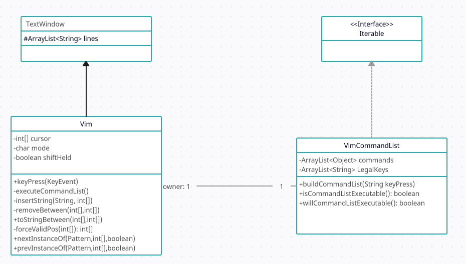

# Del 1: Beskrivelse av appen
Vi har laget en applikasjon der målet er å redigere en tekst etter en fasit.
Dette gjøres ved hjelp av vim-kommandoer.
Brukeren ser to tekstbokser der den ene er en fasittekst og den andre er en litt endret versjon av denne teksten.
Til høyre er et panel med knapper som starter og avslutter en runde, knapper som bytter fasittekst, en tekstboks til å skrive inn navn, en poengtavle, en tastetrykksteller, og en stoppeklokke.
I den redigerbare teksten er det en farget bokstav, dette er pekeren.
Dersom en linje er farget grå betyr det at denne linjen tilsvarer linjen ved samme linjenummer i fasiten.
Når brukeren har redigert teksten slik at den tilsvarer fasitteksten vil navn, tid, og antall tastetrykk lagres i en fil.
Poenget med spillet er å redigere teksten enten så fort som mulig, eller ved hjelp av så få tastetrykk som mulig.

# Del 2: Diagram

Sentralt i appen er hvordan tekstvinduene og tekstredigering fungerer.
Begge tekstvinduene er instanser av textwindow klassen TextWindow.
Denne klassen lagrer en teksten som en array med strenger.
Vim-klassen arver fra denne og tilbyr metoder for tastaturinndata, og tekstredigering med vim-kommandoer.
Disse kommandoene kan kombineres på mange måter, så vi fant ut at det var hensiktsmessig å konvertere tataturinndataen til en liste med kommandoer som er lettere å håndtere.
Vim deligerer ansvaret for å holde styr på denne listen til VimCommandList.
Denne klassen har en liste med kommandoer, og metoder for å "bygge" denne listen fra tastaturinndata, og hvorvidt listen er en gyldig kombinasjon av kommandoer.
Klassen implenterer også grensesnittet Iterable.
Samhandlingen mellom disse klassene er vist i dagrammet under.

# Del 3: Spørsmål
## 1: Hvilke deler av pensum er dekket i prosjektet?
Det er det flere eksempel på delegering.
Vim delegerer ansvaret for å konvertere tastetrykk til utførbare kommandoer til VimCommandList.
Game delegerer stoppeklokke og tastetrykksteller til henholdsvis Stopwatch og KeypressCounter.

Som nevnt i del 2 har vi brukt både arv og grensesnitt.
Vim.java arver fra TextWindow.java.
På denne måten slipper man å programmere metoder for å oppbevare og endre tekst to ganger.
Iterable implementeres av VimCommandList for å lettere kunne iterere gjennom klassen.

Lambdauttrykk og Regexer benyttes også i Vim og VimCommandList.
Labdauttrykk brukes for å finne kommandoer i kommandolisten, mens regexene brukes til å søke i teksten.

Vi dekker også deler av pensum utenfor selve programmet.
Egendefinerte JUnit tester validerer viktige funksjoner i programmet.
Det er også laget et klassedigramm som viser sammenhengen mellom klassene i kjernen av programmet.

## 2: Hvilke deler av pensum er ikke dekket i prosjektet?
Appen dekker altså de fleste temaene fra pensum, men den nytter likevel ikke alt som er mulig innen disse temaene.
Vi implementerer kun ett av grensesnittene fra pensum, og har heller ingen egendefinerte grensesnitt.
Et grensesnitt og klasser for kommandoer i VimCommandList hadde ikke vært malplassert.
Løsningen vi landet på var representere de med Object-klasser, som kanskje er mindre lestbart og brukbart enn klasser med et felles grensesnitt. 
Appen har heller ingen eksempler på abstrakte klasser eller metoder. 
Flere typer assosiasjoner, som 1-n og n-n er ikke i appen.

## 3: Hvordan forholder koden seg til MVC-prinsippet?
Visningsdelen vår er stort sett i add.fxml-filen.
Den blir påvirket av enkelte metoder i kontrolleren Controller.java.
Kontrolleren vår oppfyller ikke MVC-prinsippets regler perfekt ettersom kontrolleren inneholder logikk som riktignok burde vært i modelldelen [1].
Controller.populateTextFlow(TextFlow textFlow, int maxLineLength) regner ut \<Text\>-objektene som gjør opp den redigerbare delen av teksten.
Dette gjøres for å kunne fargelegge forskjellige individuelle deler av teksten.
Det hadde selvfølgelig vært mulig å flytte til modelldelen av programmet men ettersom den jobber med fxml-objekter er det praktisk å ha den i kontrolleren.

## 4: Hvordan har dere gått frem for å teste programmet?
Vi har testet programmet både ved å kjøre programmet, main metoder i klassene, og JUnit tester.
Under utvikling ble metoder i stor grad testet ved å kjøre programmet. 
Dette er hensiktsmessig med 
Det vil si at vi testet ved å bruke den som den ville blitt brukt i programmet.
Vi har brukt både debugger og System.out.println(); for å holde styr på verdier gjennom programmets kjøring.
Viktige metoder med mange hjørnetilfeller utviklet vi JUnit tester for, for å være mer sikre på at de kjører som de skal.

### Referanser
[1]: [Model-View-Controller. *Wikipedia*.](https://en.wikipedia.org/wiki/Model%E2%80%93view%E2%80%93controller)

[2]: [Vim. *Man page*.](https://manpages.org/vim)